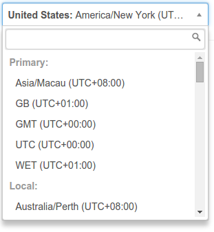
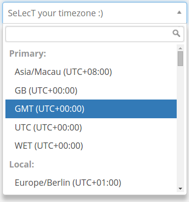

# Timezone selector for Angular JS

A simple AngularJS directive to create timezone select. It uses [chosen](http://harvesthq.github.io/chosen/) to create auto-complete timezone select. Timezone information comes from [moment](http://momentjs.com/timezone/). Countries timezone data comes from [TimezoneDB](http://timezonedb.com/download).

The user is able to choose their timezone by either typing the name of their country, or the name of the timezone directly.

The angular model that is bound to this directive will be set to the timezone name as used by [moment-timezone](http://momentjs.com/timezone/docs/) i.e `Pacific/Auckland`.

### [View Demo](http://mishguruorg.github.io/angular-timezone-selector/)
### [Plunker Example](https://plnkr.co/edit/99qoqLYUlFVsaIHUbbT8?p=preview)

## Contributing
If you have a feature or fix please submit a pull request! This repo follows JavaScript standard style, please make sure all pull requests comply to this before submitting them.

[](https://github.com/feross/standard)


## Usage

Install using bower

```
bower install angular-timezone-selector
```

Make your Angular module depend on module `angular-timezone-selector`.

```javascript
angular.module('timezoneSelectExample', ['angular-timezone-selector']);
```

Then use directive `timezone-selector`.

```html
<timezone-selector ng-model="timezone">
```

## Options

Options can be included as attributes in the html element.

 - **sort-by** ["offset"] - This lets the list be sorted by UTC offset instead of alphabetical order.
 - **display-utc** ["true"] - This show UTC offsets in the timezone names
 - **show-local** ["true"] - This detects local timezone's and includes at the top. If jsTimezoneDetect is installed if will include the detected timezone otherwise it fallback on moment js and list all timezones with the same browsers UTC offset.
 - **set-local** ["true"] - This sets ngModel to detected timezone if it's not set yet. jsTimezoneDetect must be installed for this option to work.
 - **primary-choices** ["space seperated timezone names"] - This lets you put important timezone's at the top of the list or include extra aliases. Use names from momentjs-timezone, which you can list with the command: `moment.tz.names;`.
 - **width** - Sets the width of the element

An example of using the options is below:

```html
<timezone-selector
    ng-model="timezone"
    display-utc="true"
    sort-by="offset"
    show-local="true"
    set-local="true"
    primary-choices="UTC GB WET GMT Asia/Macau"
    width="400px"
></timezone-selector>
```

## Screenshot
The screenshot below show angular-selector in action with all options enabled:

</img>

## Custom placeholder:
An example of using a custom placeholder message:

```html
<div ng-init="translations.placeholder = 'SeLecT your timezone :)'">
    <timezone-selector
        ng-model="result"
        translations="translations"
        display-utc="true"
        sort-by="offset"
        show-local="true"
        primary-choices="UTC GB WET GMT Asia/Macau"
        name="timezone"
        required>
    </timezone-selector>
</div>
```

or with translate:

```html
<div ng-init="translations.placeholder = ('TIMEZONE_PLACEHOLDER' | translate)">
    <timezone-selector
        ng-model="result"
        translations="translations"
        display-utc="true"
        sort-by="offset"
        show-local="true"
        primary-choices="UTC GB WET GMT Asia/Macau"
        name="timezone"
        required>
    </timezone-selector>
</div>
```

</img>

## Author
[Ashok Fernandez](https://github.com/ashokfernandez)

#### With Thanks To
[M Clark](https://github.com/wassname) for adding options for primary & local timezones, and the ability to show and sort by offset.

[a-k-g](https://github.com/a-k-g) for fixing syntax error in data file and reminding me to update the bower tags!

[Tom Grooffer](https://github.com/tomgrooffer) for fixing a crash with JSTZ

[karlhaas](https://github.com/karlhaas) for fixing a crash when two instances were present on the same page and adding injectable strings and translations

[G-Lex](https://github.com/G-Lex) for adding the ability to set the width when creating the directive

[Gu1](https://github.com/Gu1) for making sure that moment was properly injected

[tiagotex](https://github.com/tiagotex) for adding the ability to set the local timezone as default, and fixing a bug where primary timezones with spaces wouldn't work

[Rémy Dufour](https://github.com/Kilimangaro) for adding Montreal as a timezone

[Akiko Takano](https://github.com/akiko-pusu) for adding more translation support

#### Attributions
Inspired by [angular-timezone-select](https://github.com/alexcheng1982/angular-timezone-select) from [alexcheng1982](https://github.com/alexcheng1982).

Styled using the examples from [bootstrap-chosen](https://github.com/alxlit/bootstrap-chosen) by [alxlit](https://github.com/alxlit)
